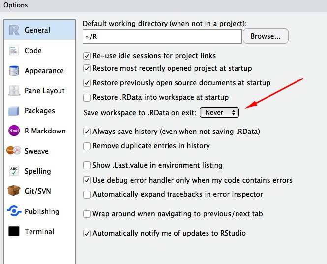

```{r setup, include=FALSE}
library(knitr)
library(tidyverse)

knitr::opts_chunk$set(echo = TRUE)
```

# Contents

1. Getting started  
1. Lesson 1: Processing data
1. Lesson 2: Visualizing data
1. Lesson 3: Modeling data 
1. Lesson 4: Text analysis
1. Lesson 5: Social network analysis
1. Considerations for using social media data in LD&T research
1. Learning and doing more with R

# Getting started

## Why learn R?

* It is capable of carrying out basic and complex statistical analyses
* It is able to work with data small (*n* = 30!) and large (*n* = 100,000+) efficiently
* It is a programming language and so is quite flexible
* There is a great, inclusive community of users and developers (and teachers)
* It is cross-platform, open-source, and freely-available

## Installing R and RStudio

**To download R:**

* [Visit this page to download R](https://cran.r-project.org/)
* Find your operating system (Mac, Windows, or Linux)
* Download the 'latest release' on the page for your operating system and download and install the application

**To download RStudio:**

* [Visit this page to download RStudio](https://rstudio.com/products/rstudio/download/)
* Find your operating system (Mac, Windows, or Linux)
* Download the 'latest release' on the page for your operating system and download and install the application

**Check that it worked:**

Open RStudio. Find the console window and type in `2+2`. If what you can guess is returned (hint: it's what you expect!), then RStudio *and* R both work.

```{r, eval=FALSE}
2+2
```

## RStudio Cloud: An alternative

If you are having trouble downloading R or RStudion, don't worry, you're not alone. In fact, in the workshops we've run, we have seen enough new R users struggle just to get going that we now suggest using RStudio Cloud as an alternative. 

**[This link will take you to the RStudio Cloud project for this workshop](https://rstudio.cloud/project/964811).**

Once you have navigated to this webpage, log in using a Google or Github account. Then, create a permanent copy of the project in your own workspace (see the prompt at the top of the page guiding you to do this.

From here, you can write and run R code exactly as your would through RStudio on your computer. The downside is that opening and loading projects are slowed by Internet connection speeds. The upside is that you don't have to worry about R and RStudio downloads, and your computing power is running off of RStudio Cloud's servers, not your local machine. Once you start running advanced statistical models, computing power bgins to make a huge difference.

## Working with R projects

Before proceeding, we're going to take a few steps to set ourselves to make the analysis easier; namely, through the use of Projects, an RStudio-specific organizational tool.

(To create a project in RStudio, you can navigate to "File" and then "New Directory". Then, click "New Project".)

Names should be short and easy-to-remember but also informative.

## Looking at RStudio

```{r, out.width = "720px", echo = FALSE, fig.align = "center"}
include_graphics("img/RStudio.png")
```

## R packages

"Packages" are shareable collections of R code that provide functions (i.e., a command to perform a specific task), data, and documentation. Packages increase the functionality of R by improving and expanding on base R (basic R functions). 

### Installing and Loading Packages

To download a package, you must call `install.packages()`:

```{r, eval = FALSE}
install.packages("dplyr")
```

You can also navigate to the Packages pane, and then click "Install", which will work the same as the line of code above. This is a way to install a package using code or part of the RStudio interface. 

Usually, writing code is a bit quicker, but using the interface can be very useful and complementary to use of code. 

### Using packages

*After* the package is installed, it must be loaded into your RStudio session using `library()`:

```{r}
library(dplyr)
```

We only have to install a package once, but to use it, we have to load it each time we start a new R session.

> A package is a like a book, a library is like a library; you use library() to check a package out of the library
> (Hadley Wickham, Chief Scientist, RStudio)

In this case, [dplyr](https://www.rdocumentation.org/packages/dplyr/versions/0.7.8) is a package providing "a grammar of data manipulation, providing a consistent set of verbs that help you solve the most common data manipulation challenges."

## Configuring RStudio

By default, RStudio saves all of the objects in your environment. In general, this is not ideal, because it means that you may have taken steps interactively that are not documented your code.

```{r, out.width = "425px", echo=FALSE, fig.align = "center"}

```

## The tidyverse

The **tidyverse** is a set of packages for data manipulation, exploration, and visualization using the design philosophy of 'tidy' data. Tidy data has a specific structure: each variable is a column, each observation is a row, and each type of observational unit is a table.

The packages contained in the tidyverse provide useful functions that augment base R functionality.

You can instal and load the complete tidyverse with:

```{r, eval = FALSE}
install.packages("tidyverse")
```

Be sure to run this next line to load the tidyverse. You do this each time you open R.

```{r, message = FALSE}
library(tidyverse)
```

 We will use a sample of categorical variables from the General Social Survey (GSS) included with the **tidyverse** package, `gss_cat`:

```{r, eval=FALSE}
gss_cat
```

# Lesson 1: Processing data

### (Difficulty: Easy)

## The pipe: %>% 

First, let's load the data we downloaded in the last step.

```{r, message = FALSE}
student_responses <- readr::read_csv("student-responses-data.csv")
```

We're also going to introduce a powerful, unusual *operator* in R, the pipe. The pipe is this symbol: `%>%`. It lets you *compose* functions. It does this by passing the output of one function to the next.

The `select()` function from **dply** that reduces the number of *columns* of a dataset.

```{r, eval = FALSE}
student_mot_vars <- # save object student_mot_vars by...
  student_responses %>% # using dataframe student_responses
  select(SCIEEFF, JOYSCIE, INTBRSCI, EPIST, INSTSCIE) # and selecting only these five variables

student_mot_vars
```

Also, check out the helper functions: `contains()`, `starts_with()`, and `ends_with()`, i.e.:

```{r, eval = FALSE}
student_responses %>% 
  select(contains("sci"))
```

## Saving the results

Note that we saved the output from the `select()` function to `student_mot_vars` but we could also save it back to `student_responses`, which would simply overwrite the original data frame (the following code is not run here):

```{r, eval = FALSE}
student_responses <- # save object student_responses by...
  student_responses %>% # using dataframe student_responses
  select(SCHID, SCIEEFF, JOYSCIE, INTBRSCI, EPIST, INSTSCIE) # and selecting only these six variables
```

## Renaming

We can also rename the variables at the same time we `select()` them. Let's save the results to `student_mot_vars`.

```{r}
student_mot_vars <- student_responses %>% 
  select(teacher_id = SCHID,
         student_efficacy = SCIEEFF,
         student_joy = JOYSCIE, 
         student_broad_interest = INTBRSCI,
         student_epistemic_beliefs = EPIST,
         student_instrumental_motivation = INSTSCIE
  )

student_mot_vars %>% 
  head(3) # displays first 3 rows of the dataframe
```

## Creating a new variable

`mutate()` takes instructions to create a new variable.

What goes *before* the equals sign is the name of the new variable.

What goes after are the instructions.

```{r}
student_responses %>% 
  select(teacher_id = SCHID, 
         student_efficacy = SCIEEFF, 
         student_joy = JOYSCIE, 
         student_broad_interest = INTBRSCI, 
         student_epistemic_beliefs = EPIST,
         student_instrumental_motivation = INSTSCIE) %>% 
  mutate(student_joy_interest = (student_joy + student_broad_interest) / 2) %>% 
  head(3)
```

## Filtering the data set

`filter()` uses *logical statements* (statements that can evalute to true or false) to select a number of *rows* from a dataset.

```{r}
student_responses %>% 
  select(teacher_id = SCHID, 
         student_efficacy = SCIEEFF, 
         student_joy = JOYSCIE, 
         student_broad_interest = INTBRSCI, 
         student_epistemic_beliefs = EPIST,
         student_instrumental_motivation = INSTSCIE) %>% 
  mutate(student_joy_interest = (student_joy + student_broad_interest) / 2) %>% 
  filter(student_joy_interest > mean(student_joy_interest, na.rm = TRUE)) %>% 
  head(3)
```

## Grouping and summarizing

It is often useful to aggregate a data set.

The `group_by()` and `summarize()` functions are especially helpful for this purpose.

Let's find the mean, standard deviation, and counts of student broad interest by teacher.

```{r}
student_responses %>% 
  select(teacher_id = SCHID, 
         student_broad_interest = INTBRSCI) %>% 
  group_by(teacher_id) %>% 
  summarize(student_broad_interest_mean = mean(student_broad_interest, na.rm = TRUE),
            student_broad_interest_sd = sd(student_broad_interest, na.rm = TRUE),
            n = n()) %>% 
  head(3)
```

## Arranging

Finally, let's arrange the table by the number of students in each class.

`arrange()` sorts in order from the smallest to largest values.

`desc()` tells `arrange()` to sort in descending order.

```{r}
student_responses %>% 
  select(student_broad_interest = INTBRSCI, 
         teacher_id = SCHID) %>% 
  group_by(teacher_id) %>% 
  summarize(student_broad_interest_mean = mean(student_broad_interest, na.rm = TRUE),
            student_broad_interest_sd = sd(student_broad_interest, na.rm = TRUE),
            n = n()) %>% 
  arrange(desc(n)) %>% 
  head(3)
```

## Counting

Sometimes, we simply want to count the number of observations associated with each group.

```{r, eval = FALSE}
student_responses %>% 
  select(teacher_id = SCHID) %>% 
  count(teacher_id)
```

We could then use this `count()` as the basis of *other* summary statistics.

```{r}
student_responses %>% 
  select(teacher_id = SCHID) %>% 
  count(teacher_id) %>% 
  summarize(n_mean = mean(n),
            n_sd = sd(n))
```

On average, there are approximately 32 (*SD* = 8.61) students in each teachers' class.

# Loading a CSV File

Okay, we're ready to go. The easiest way to read a CSV file is with the function `read_csv()` from the package **readr**, which is contained within the tidyverse.

Again, we'll load (or have loaded, already) the tidyverse library.

```{r, message = FALSE}
library(tidyverse) # so tidyverse packages can be used for analysis
```

Just as a recap of a line that we ran earlier. 

```{r, eval = TRUE, message = FALSE}
student_responses <- readr::read_csv("student-responses-data.csv")
```

Since we loaded the data, we now want to look at it. We can type its name in the function `glimpse()` to print some information on the dataset (this code is not run here).

```{r, eval = FALSE}
glimpse(student_responses)
```

You can also print the name of the object. 

# Loading Excel and SAV files

## Loading Excel files

```{r, eval = FALSE}
install.packages("readxl")
```

```{r, eval = FALSE}
library(readxl)
```

```{r, eval = FALSE}
my_data <-
  read_excel("path/to/file.xlsx")
```

## Loading SAV files

```{r, eval = FALSE}
install.packages("haven")
```

```{r, eval = FALSE}
library(haven)
my_data <-
  read_sav("path/to/file.sav")
```

# Saving (Writing) Files

Using our data frame `student_responses`, we can save it as a CSV (for example) with another function from **readr**, `write_csv()`. The first argument, `student_reponses`, is the name of the object that you want to save. The second argument, `student-responses.csv`, what you want to call the saved dataset.

```{r, eval = FALSE}
write_csv(student_responses, "student-responses-data.csv")
```

This will save a CSV file titled `student-responses-data.csv` in the working directory. If you want to save it to another directory, simply add the file path to the file, i.e. `path/to/student-responses-data.csv`. To save a file for SPSS, load the **haven** package and use `write_sav()`. There is not a function to save an Excel file, but a file saved as a CSV can be directly loaded into Excel.


--------------------------------------------------------------------------------


# Try it out! (Lesson 1)

## select()

Let's select only a few variables.

```{r, eval=FALSE}
gss_cat %>% 
  select(year, tvhours)
```

```{r, eval=FALSE}
gss_cat %>% 
  select(year, marital, tvhours)
```

**Try it out!**

Now, select three *different* variables, and run the code chunk to view the result.

```{r, eval=FALSE}
gss_cat %>% 
  select()
```

## filter()

```{r, eval=FALSE}
gss_cat %>% 
  filter(age > 60)
```

**Try it out!**

Filter to include only those individuals who watch a lot of TV - more than 10 hours per *day*!

Be sure to run the result to see whether it did what you think it should do!

```{r, eval=FALSE}
gss_cat %>% 
  
```

## mutate()

Let's create a new variable for those 60 years of age or older.

```{r, eval=FALSE}
gss_cat %>% 
  mutate(potential_senior = if_else(age >= 63.5, 1, 0),
         super_senior = if_else(potential_senior == 1 & tvhours < 2, 1, 0)) %>% 
  count(potential_senior, super_senior)
```

Let's save the results back to `gss_cat` and make sure that it worked.

```{r, eval=FALSE}
gss_cat <- gss_cat %>% 
  mutate(potential_senior = ifelse(age >= 63.5, TRUE, FALSE))
```

Adding another variable for folks who are middle-aged.

```{r, eval=FALSE}
gss_cat <- gss_cat %>% 
  mutate(middle_aged = ifelse(age >= 30 & age <= 40, "yes", "no"))
```

**Try it out!**

Can you create a new variable based upon either the *year* or *tvhours* variable using `if_else()`? 

```{r, eval=FALSE}
gss_cat %>% 
  mutate()
```

Then, save the results back to `gss_cat` (check out the code two chunks above for an example!).

```{r, eval=FALSE}
gss_cat %>% 
  mutate()
```


--------------------------------------------------------------------------------


### End of Lesson 1!


--------------------------------------------------------------------------------


# Lesson 2: Visualizing data

### (Difficulty: Easy)

## The grammar of graphics

**ggplot2** is a tidyverse package for creating visualizations (or figures).

Let's work with a smaller data set, for now.

```{r}
student_mot_vars <- # save object student_mot_vars by...
  student_responses %>% # using dataframe student_responses
  select(student_efficacy = SCIEEFF, # selecting variable SCIEEFF and renaming to student_efficiency
         student_joy = JOYSCIE, # selecting variable JOYSCIE and renaming to student_joy
         student_broad_interest = INTBRSCI, # selecting variable INTBRSCI and renaming to student_broad_interest
         student_epistemic_beliefs = EPIST, # selecting variable EPIST and renaming to student_epistemic_beliefs
         student_instrumental_motivation = INSTSCIE,  # selecting variable INSTSCIE and renaming to student_instrumental_motivation
         teacher_id = SCHID
  )
```

## Scatter plot

Notice that there are three parts to all **ggplot2** graphs: a) the data (`student_mot_vars`), b) an `aes()` (aesthetic mapping), and c) a `geom`:

```{r, warning = FALSE, out.width = "320px", echo = TRUE, fig.align = "center"}
ggplot(data = student_mot_vars,
       aes(x = student_efficacy, y = student_broad_interest)) + # sets up the plot
  geom_point() # adds points to the plot
```

## Scatter plot with a regression line

```{r, warning = FALSE, out.width = "320px", echo = TRUE, fig.align = "center"}
ggplot(student_mot_vars,
       aes(x = student_efficacy, y = student_broad_interest)) +
  geom_point() +
  geom_smooth(method = "lm") # notice how you keep adding new geom_ layers
```

## Cleaning up

```{r, warning = FALSE, out.width = "320px", echo = TRUE, fig.align = "center"}
ggplot(student_mot_vars,
       aes(x = student_efficacy, y = student_broad_interest)) +
  geom_point(alpha = 0.2) + # 'alpha' controls the transparency of points
  geom_smooth(method = "lm") +
  theme_bw() +
  xlab("Student Efficacy") +
  ylab("Student Broad Interest")
```


--------------------------------------------------------------------------------


# Try it out! (Lesson 2)

`geom_jitter()` is exactly like geom_point, but with a small amount of x- and y-axis random noise added.

```{r, eval=FALSE}
ggplot(gss_cat, aes(x = age, y = tvhours)) +
  geom_jitter()
```

**Try it out!**

Can you add a line representing the linear relationship between the two varibles? Add another layer using a `geom_` function.


```{r, eval=FALSE}
# hint: check out how a line was added in the presentation

ggplot(gss_cat, aes(x = age, y = tvhours)) +
  geom_jitter() +
  geom_
```

Let's try a different theme.

```{r, eval=FALSE}
ggplot(gss_cat, aes(x = age, y = tvhours)) +
  geom_jitter() +
  theme_bw()
```

**Try it out!**

Can you add a different theme? Start typing `theme_` and see what shows up! Be sure to run the code to see the results!

```{r, eval=FALSE}
ggplot(gss_cat, aes(x = age, y = tvhours)) +
  geom_jitter() +
  theme_
```

Does the relationship appear to be different by year?

```{r, eval=FALSE}
ggplot(gss_cat, aes(x = age, y = tvhours)) +
  geom_jitter() +
  facet_wrap(~year)
```

**Try it out!**

Can you add lines of best fit to the above plots?

```{r, eval=FALSE}
ggplot(gss_cat, aes(x = age, y = tvhours)) +
  geom_jitter() +
  geom_
  facet_wrap(~year)
```


--------------------------------------------------------------------------------


### End of Lesson 2!


--------------------------------------------------------------------------------


# Lesson 3: Modeling data

### (Difficulty: Easy)

## Linear models

The `lm()` function (part of the **stats** package that comes with R) is a very helpful general purpose function for linear models. We'll use the `student_mot_vars` data frame we created earlier.

```{r}
lm(student_epistemic_beliefs ~ student_broad_interest, data = student_mot_vars)
```

Let's save the results back to an object, `m1`.

```{r}
m1 <- lm(student_epistemic_beliefs ~ student_broad_interest, data = student_mot_vars)
```

We can then run `summary()` on the output:

```{r}
summary(m1)
```

You can also build more complex models, such as:

```{r, eval}
m2 <- lm(student_epistemic_beliefs ~ student_broad_interest + 
                                      student_joy + 
                                      student_broad_interest:student_joy, 
         data = student_mot_vars)
```

You can then again run `summary()` to view the results.

```{r}
summary(m2)
```

## Multi-level models

To add even more complexity, you can use the `lmer()` function from the **lme4** package:

```{r, eval = FALSE}
install.packages(lme4)
library(lme4)
```

```{r}
m2_mlm <- lme4::lmer(student_epistemic_beliefs ~ 
                       student_broad_interest + 
                       student_joy + 
                       student_broad_interest:student_joy + 
                       (1 | teacher_id), 
                     data = student_mot_vars)
```

Once more, run `summary()` to view the results.

```{r}
summary(m2_mlm)
```


--------------------------------------------------------------------------------


# Try it out! (Lesson 3)

Let's run a linear regression using `lm()`:

```{r, eval = FALSE}
m1 <- lm(tvhours ~ age, data = gss_cat)
summary(m1)
```

Character strings and factors are automatically dummy-coded by `lm()`:

```{r, eval = FALSE}
m2 <- lm(tvhours ~ marital, data = gss_cat)
summary(m2)
```

**Try it out!**

Can you add another variable to the model? If you need to check what variables are in `gss_cat`, print that object to the console. What do you notice about the output?

```{r, eval = FALSE}
m3 <- lm(tvhours ~ age + , data = gss_cat)
summary(m3)
```


--------------------------------------------------------------------------------


### End of Lesson 3!


--------------------------------------------------------------------------------


# Lesson 4: Text analysis 

### (Difficulty: Moderate)

There are all kinds of things you might wonder about the text of a document. For instance:

* How many words are in a document?
* Which words are most used most often in a text?
* How many times is a specific word used?


--------------------------------------------------------------------------------


# Try it out! (Lesson 4)

## Accessing data

[We will be using Twitter data, which you can view here.](https://docs.google.com/spreadsheets/d/1kJk0I4YTh_XQMua7gXSQ2t0All53srBCXFI4KDsSPs8/edit#gid=400689247)

There are a number of ways you can access it.

### 1: Downloading the file directly via R

```{r, eval = FALSE}
url <- "https://docs.google.com/spreadsheets/d/1kJk0I4YTh_XQMua7gXSQ2t0All53srBCXFI4KDsSPs8/edit#gid=400689247"

file_name <- "" # add a file name that ends in .csv

download.file(url, destfile = file_name)
```

### 2: Manually downloading the file

To manually download the file, [go to the Google Sheet](https://docs.google.com/spreadsheets/d/1kJk0I4YTh_XQMua7gXSQ2t0All53srBCXFI4KDsSPs8/edit#gid=400689247), navigate to the **Archive** tab, and then click *File* -> *Download* -> *Comma-separated values* (or *Microsoft Excel*).

### 3: Collect your own!

Use [TAGS](https://tags.hawksey.info/). Note that this requries that you authenticate with Google and Twitter accounts.

## Reading the data

Next, you will need to read the data into R. Depending on how you accessed the data, there are a number of ways to do this.

*If* you downloaded the file directly via R (option 1, above), then you can read the data using the same file name (saved to `file_name`) you used above.

Either type the same file name, in quotation marks (e.g., "my_file_name.csv") within the parentheses of `read_csv()` below (or use `file_name` directly and try to figure out what's happening!):

```{r, eval = FALSE}
df <- read_csv()
df
```

*If* you manually downloaded the file (and saved it to the directory you are working in), then it may be helpful to rename the file. Consider naming the file something easy to understand and to type. Then, read the data by typing the file name in quotation marks (e.g., "my_file_name.csv") within the parentheses of `read_csv()` below. 

Note: another option is to use click the name of the file in your 'Files' window and then to click 'Import Dataset'; it is important to copy the code that that wizard generates into a script so that you can re-run your analyses.

```{r, eval = FALSE}
df <- read_csv()
df
```

If you haven't already, be sure to type `df` (short for dataframe) into the console (or to run the chunk above) to see what the data look like. If something doesn't look right, consider what might have gone wrong (when accessing, renaming, or reading the data).

## Preparing the data for analysis

Text data can be stored a number of ways. We will focus on a common data structure, a document-term matrix. 

The idea that is essential for understanding a document-term matrix is that it is simply a data frame with every term across every document comprising the columns, and every document being represented with each row. 

We will use the **quanteda** R package to create a document term matrix. To do so, we will use the `tokens()` function, which takes as a first argument the column of a data frame with text. An easy way to do this is via the `pull()` function, which returns just one column from a data frame. Pass to `pull()` the name of your data frame and the name of the column `text`, e.g., `pull(my_data_frame, text)`, directly to the tokens function.

```{r, eval = FALSE}
# install.packages("quanteda")
library(quanteda)
my_tokens <- tokens()
```

Run `?tokens` in your console. Make some changes to the arguments to process the data in a way that is suited to the Twitter data (check out the arguments that begin `remove_`).

Once you have tokenized the text in a  way that you think is suitable, proceed to the next function, `dfm()`, which creates a document term matrix.

```{r, eval = FALSE}
my_dfm <- dfm(my_tokens)
```

One argument that you can add to `dfm()` that is commonly helpful is `remove = stopwords("english")`. There are a number of options for how you remove stopwords, or common words: check `?stopwords()` and see how to try out the different options. Another argument that is helpful argument is `stem`, which can be set to `TRUE` but defaults to `FALSE`. If set to true, words will be reduced to a common "stem," e.g., the words "writing" and "written" may be reduced to "writ".

## Creating output

Though a basic step, assessing the most frequent terms can be powerful. The `topfeatures()` function can be helpful for this; simply pass `my_dfm` as the first argument to it to see the results.

```{r, eval = FALSE}
topfeatures(my_dfm)
```

Your turn! Can you change the number of terms that are returned? (Hint: check `?topfeatures`.) Are the results interpretable? If not, what changes can you make (either through what you pass to `tokens()` or `dfm()`) to improve the output?

A common representation that can be helpful for communicating what the most frequent terms are is a word cloud; simply pass `my_dfm` to `textplot_wordcloud()` (and check `?textplot_wordcloud` to see the options you can change).

```{r, eval = FALSE}
textplot_wordcloud(my_dfm)
```

While wordclouds are common (and are fun to interpret), there are a number of other representations of how frequent terms are (and many analyses that can be run using text data). If you made it this far, check out the [Quanteda Tutorials](https://tutorials.quanteda.io/) book.


--------------------------------------------------------------------------------


### End of Lesson 4!


--------------------------------------------------------------------------------


# Lesson 5: Social network analysis

## Accessing data


### (Difficulty: Hard)

*A network is a set of objects, and network analysis is interested in the relationships between them.*

So, what are the objects? How are they related?


--------------------------------------------------------------------------------


# Try it out! (Lesson 5)

## Accessing data

[We will be using the same Twitter data as in Lesson 4, which you can view here.](https://docs.google.com/spreadsheets/d/1kJk0I4YTh_XQMua7gXSQ2t0All53srBCXFI4KDsSPs8/edit#gid=400689247)

Recall that you loaded the data and stored into a variable named `df`.

## Preparing the data for the analysis

Network data, in general, and potential network data from Twitter, in particular, require some processing before they can be used in subsequent analyses.

### Extracting retweets

First, let's get the retweets. We'll identify retweets on the basis of the tweet beginning with the pattern "RT @". Be sure to replace `my_data_frame` with the name of your data frame. 

There is a lot going on in the code below; let's break it down line-by-line, starting with the `mutate()`:

* `first_four_chars = str_sub(text, start = 1, end = 4),`: this line of code identifies the first four characters of the tweet
* `is_retweet = str_detect(first_four_chars, "RT @"),`: this line of code then determines whether the first four characters - identified through the last line of code - begin with "RT @"
* `retweeted_username = ifelse(is_retweet, str_extract(text, regex), NA))`: this line of code determine if a tweet is a retweet - identified through the very last line of code - and, then, if it is, extracts the *first* username (note that `str_extract()`, instead of `str_extract_all()`, is used for this purpose), using the same regex used earlier.

We'll use a *regular expression*, or regex, to do so. A lot of the new functions you'll see here are part of the **stringr** package, which you already loaded as part of the tidyverse.

Find one of the regular expression (or regex) patterns that are in an answer on this page; all should work, but some work a bit easier than others. Read more on this [Stack Overflow discussion thread](https://stackoverflow.com/questions/18164839/get-twitter-username-with-regex-in-r) if you're having trouble.

```{r, eval = FALSE}
regex <- ""

my_data_frame <- my_data_frame %>% 
  mutate(first_four_chars = str_sub(text, start = 1, end = 4),
         is_retweet = str_detect(first_four_chars, "RT @"),
         retweeted_username = ifelse(is_retweet, str_extract(text, regex), NA))
```

Let's put the retweets in their own data frame, called `retweets`.

```{r, eval = FALSE}
retweets <- my_data_frame %>% 
  filter(is_retweet) %>% 
  select(from_user, retweeted_username) %>% 
  mutate(retweeted_username = str_trim(retweeted_username))
```

The very last line `mutate(all_mentions = str_trim(all_mentions))` is only necessary if the regex you used left an extra space at the beginning or at the end of the screen name. If you don't have an extra space, it won't hurt, though.

### Extracting mentions

Next, let's get the mentions. Start by replacing `my_data_frame` with the name of your data (the one you read in in the previous step). 

```{r, eval = FALSE}
my_data_frame <- my_data_frame %>% 
  mutate(all_mentions = str_extract_all(text, regex)) %>% 
  mutate(has_mention = ifelse(!is.na(all_mentions), TRUE, FALSE)) %>% 
  unnest(all_mentions)
```

Let's put these into their own data frame, too.

```{r, eval = FALSE}
mentions <- my_data_frame %>% 
  filter(has_mention) %>% 
  mutate(all_mentions = str_trim(all_mentions)) %>% 
  select(from_user, all_mentions)
```

### Putting the edgelist together

Now, we are ready to put the pieces together, in order to construct an edgelist. An edgelist is a common social network analysis data structure that has columns for the *sender* and *receiver* of interactions, or relations. For example, we can consider the person retweeting someone else "sending" a retweet to the person who is retweeted, who "receives" the retweet. For mentions, someone "sends" the mention to someone who is mentioned, who can be considered to "receive" it. This will require one last processing step. Be sure to change the name of the data frame, again.

Take a look at each data frame we created; type `mentions` and `retweets`, below:

```{r, eval = FALSE}
retweets
```

```{r, eval = FALSE}
mentions
```

What needs to happen to these to make them easier to work with in an edgelist? One step is to remove the "@" symbol from the columns we created - `retweeted_username` and `all_replies`.

Let's do this for retweets.

```{r, eval = FALSE}
retweets <- retweets %>% 
  mutate(retweeted_username = str_sub(retweeted_username, start = 2)) %>%
  mutate(interaction_type = "retweet") %>% # this is so we can distinguish between retweets and mentions
  select(sender = retweeted_username, receiver = from_user, interaction_type) # this is so the columns have the same names for when we combine them back together
```

Almost there! Let's do the same for mentions; write code that will do this, starting with the `mentions` data frame, using the code above as an example. Consider which is the receiver and which is the sender for mentions.

```{r, eval = FALSE}
mentions <- mentions %>% 
  
```

(If you're having trouble figuring out how to do this part, open the `help-me.Rmd` located in the working directory.)

Finally, create an edgelist:

```{r, eval = FALSE}
edgelist <- bind_rows(retweets, mentions)
edgelist
```

## Plotting the network

We'll use the **tidygraph** and **ggraph** packages to visualize the data.

```{r, eval = FALSE}
# install.packages(c("tidygraph", "ggraph"))
library(tidygraph)
library(ggraph)
```

We'll use the `as_tbl_graph()` function, which (by default) identifies the first column as the *sender* and the second as the *receiver*. Let's look at the object it creates, too.

```{r, eval = FALSE}
g <- as_tbl_graph(edgelist)
g
```

Next, use the `ggraph()` function. Run the code below, and then uncomment, one at a time, the next two lines (the two beginning `geom_()`, running the code after uncommenting each line).

```{r, eval = FALSE}
g %>% 
  ggraph() +
  geom_node_point() +
  # geom_node_text(aes(label = name)) +
  # geom_edge_link() +
  theme_graph()
```

Finally, size the points based on a measure of centrality, typically a measure of how (potentially) influence an individual may be, based on the interactions observed.

```{r, eval = FALSE}
g %>% 
  mutate(centrality = centrality_authority()) %>% 
  ggraph() +
  geom_node_point(aes(size = centrality, color = centrality)) +
  scale_color_continuous(guide = 'legend') + 
  geom_node_text(aes(label = name)) +
  geom_edge_link() +
  theme_graph()
```

There is much more you can do with **ggraph** (and **tidygraph**). As a start, check out the [ggraph tutorial](https://ggraph.data-imaginist.com/).

As a final note, we have been busy developing our own R package, **tidytags**, which will make the work you've done in this exploration much easier. You can check out [the in-development version of **tidytags** on Github](https://github.com/bretsw/tidytags).


--------------------------------------------------------------------------------


### End of Lesson 5!


--------------------------------------------------------------------------------


# Considerations for Using Social Media Data in Learning Design & Technology Research

## Chapter overview

Our purpose in this chapter is to suggest considerations that LDT professionals should make as they use social media data in their research. 

## Sections

1. Conducting ethical research
1. Framing the research
1. Organizing the research process
1. Collecting data
1. Analyzing data
1. Disseminating research
1. Learning and doing more with R

## Important notes

* Our purpose is *not* to dismiss traditional research methods
* There is considerable room for debate and disagreement around the proper way to conduct social media research
* Our focus is not providing answers but raising questions
* The issues and processes we raise are not linear; this is not a simple recipe to follow
* We avoid the traditional distinction between *quantitative* and *qualitative* research, and instead suggest various other distinctions as we go

## 1. Conducting ethical research

* Often, IRBs do not flag social media work as human subjects research; however, we would suggest that it is a human phenomenon
* Not a checklist, but a thorough consideration of research context and ethical principles is needed
* Public vs. private
* Harms and benefits
* Vulnerability
* Anonymity
* Consent
* Legal considerations

##  2. Framing the research

* Paradigms and assumptions
* Research design, methods, and modes of inquiry
* Conceptual frameworks
  * Community, network, or space?
* Phenomena and units of analysis

## 3. Organizing the research process

* Software
* Storing data
* Workflows
* Documentation

## 4. Collecting data

We need to move beyond *qualitative* vs. *quantitative*. Instead, think about:

* **Quantity:** big vs. small
* **Interaction with participants:** Obtrusive or unobtrusive
  * Unobtrusive: *digital traces*
* **Process**
  * Application programming interfaces (APIs)
  * TAGS + rtweet = **library(tidytags)**
  * Web scraping
  * Accessing archives

## 5. Analyzing data

* Spam (including participation inequality)
* Machine vs. human analysis
* Networks

## 6. Disseminating research

* Sharing data
* Sharing code
  * TAGS + rtweet = [library(tidytags) is available here](https://github.com/bretsw/tidytags)
  * Github (http://github.com)
  * Open Science Framework (http://osf.io)
* Publishing and publicizing research
  * Journals, conferences, social media

## Conclusion

* The ready availability of social media data provides many opportunities...
  * ...but also considerable challenges for LDT researchers.
* So, get familiar with the broad considerations,
* and don't skip asking the important questions.
* Start and end with research ethics, and revisit throughout.


--------------------------------------------------------------------------------

# Learning and doing more with R

## Resources

* [Data science in education using R](https://datascienceineducation.com/) by Bovee, Estrellado, Mostipak, Rosenberg, and Velásquez (2020)
* [R for data science](https://r4ds.had.co.nz/) by Grolemund and Wickham (2017)
* [Big magic with R: Creating learning beyond
    fear](https://speakerdeck.com/apreshill/big-magic-with-r-creative-learning-beyond-fear) by Hill (2018)
* [RStudio Community](https://community.rstudio.com/)
* [\#r4ds](https://medium.com/@kierisi/r4ds-the-next-iteration-d51e0a1b0b82) - see a talk at rstudio::conf() [here](https://resources.rstudio.com/rstudio-conf-2019/r4ds-online-learning-community-improvements-to-self-taught-data-science-and-the-critical-need-for-diversity-equity-and-inclusion-in-data-science-education) by Mostipak (2019)
* [Data science for social scientists](http://datascience.tntlab.org/) by
    Landers (2019)

## Useful packages

Install via `install.packages(<name-of-package)`, i.e., `install.packages("tidylog")`.

* tidyverse: tools for data manipulation and processing
* tidylog: companion to the tidyverse; gives you feedback
* haven: import and export files for other statistical software
* apaTables: create APA-style tables in MS Word format
* devtools: to download packages only available on GitHub
* psych: general psychological science-related analysis tools
* skimr: quickly calculate summary statistics for a data frame
* lme4: multi-level modeling (HLM)
* tipyLPA: latent profile analysis
* sjstats: convenient statistical functions
* rmarkdown: reports (PDF, Word, HTML, etc.)
* blogdown: create a website/blog
* xaringan: create presentations
* papaja: APA-style paper generation (must install from [GitHub](https://github.com/crsh/papaja))
* tidytags: Easy collection and powerful analysis of Twitter data (must install from [GitHub](https://github.com/bretsw/tidytags))

## People (and a few hashtags) to follow (on Twitter)

* [Jesse Mostipak](https://twitter.com/kierisi)
* [Alison Hill](https://twitter.com/apreshill)
* [Hadley Wickham](https://twitter.com/hadleywickham)
* [Daniel Anderson](https://twitter.com/datalorax_)
* [Mara Averick](https://twitter.com/dataandme)
* [Thomas Mock](https://twitter.com/thomas_mock)
* [Angela Li](https://twitter.com/CivicAngela)
* [R4DS community](https://twitter.com/R4DScommunity)
* [#tidytuesday](https://twitter.com/hashtag/TidyTuesday?src=hash)
* [#rstats](https://twitter.com/hashtag/rstats?src=hash)
* [David Robinson](https://twitter.com/drob)
* [Julia Silge](https://twitter.com/juliasilge)
* [Gabriela de Quieroz](https://twitter.com/gdequeiroz)
* [Emily Bovee](https://twitter.com/ebovee09)
* [Joshua Rosenberg](https://twitter.com/jrosenberg6432)
* [Spencer Greenhalgh](https://twitter.com/spgreenhalgh)
* [Bret Staudt Willet](https://twitter.com/bretsw)

## Acknowledgments

Much of the content of this workshop follows a [workshop we facilitated at the AECT 2019 annual convention](https://github.com/bretsw/aect19-workshop).

Thank you to [Emily Bovee](https://github.com/emilybovee) for co-developing the workshops this workshop is adapted from: https://github.com/jrosen48/MTSU-workshop and https://github.com/jrosen48/MSU-workshop-2019

Parts of the content for this workshop are also adapted from:

* The [*Data Science in Education Using R* book](https://github.com/data-edu/data-science-in-education) by Emily A. Bovee, Ryan A. Estrellado, Jesse Mostipak, Joshua M. Rosenberg, and Isabella C. Velásquez to be published by Routledge in 2020 
* An American Educational Research Association 2019 annual meeting [workshop on *Reproducible and transparent research with R*](https://github.com/ResearchTransparency/rr_aera19) by [Daniel Anderson](https://github.com/datalorax]) and [Joshua Rosenberg](https://github.com/jrosen48/)

Finally, parts of the content for this workshop are inspired from content associated with the [Data Science Specialization for UO COE](https://github.com/uo-datasci-specialization) (led by [Daniel Anderson](https://github.com/datalorax])).

## Questions?

Bret Staudt Willet: [staudtwi@msu.edu](mailto:staudtwi@msu.edu)
